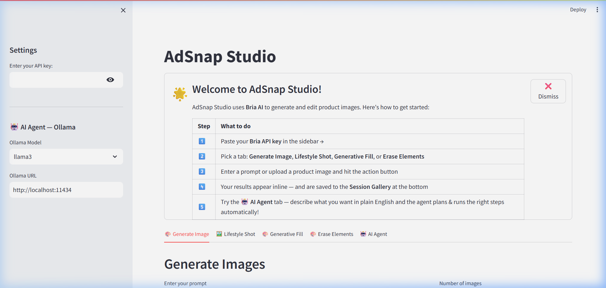
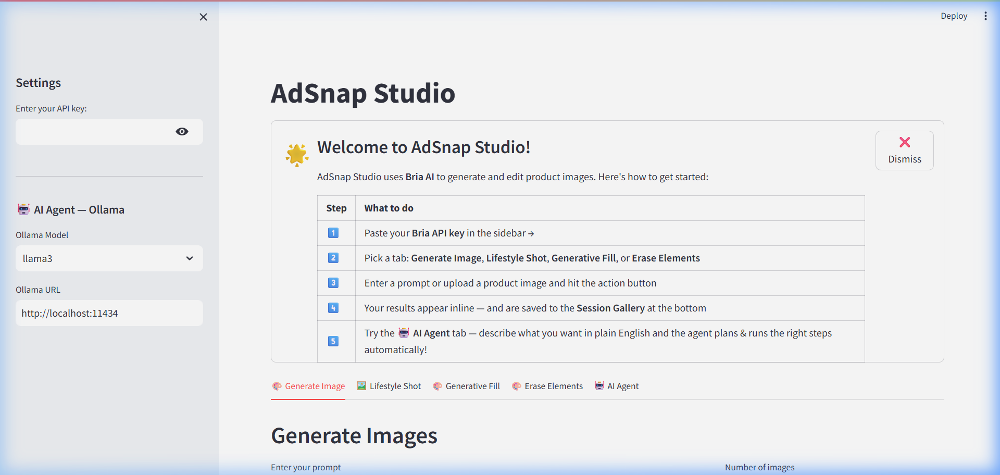
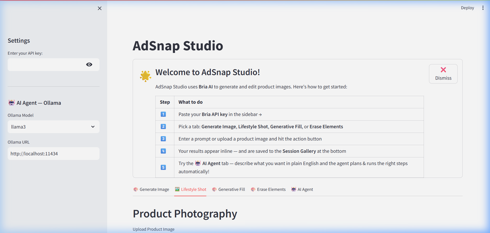
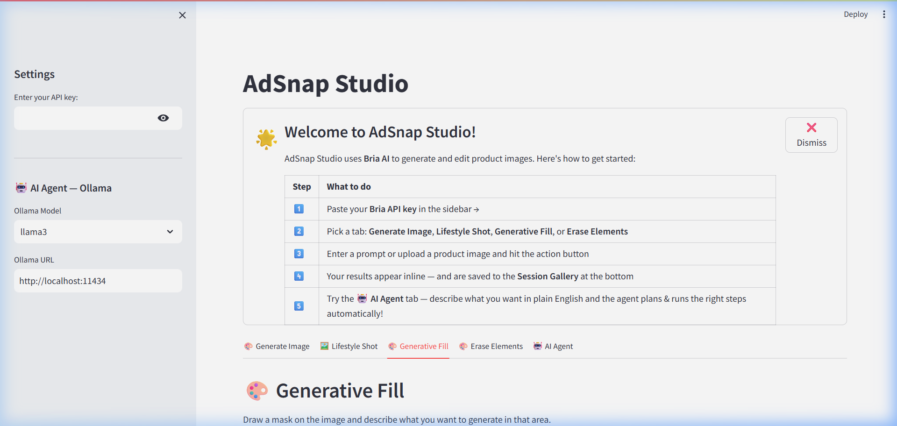
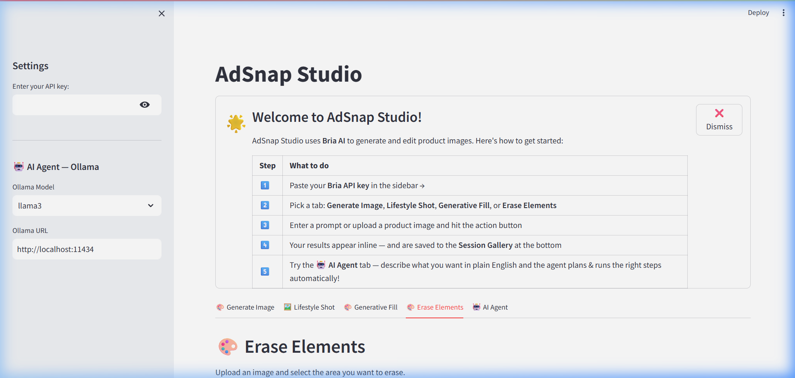
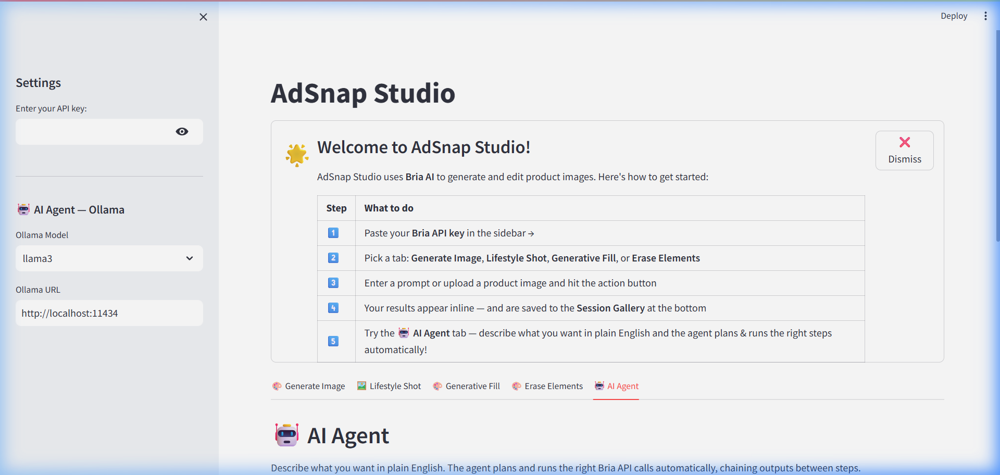

# 📸 AdSnap Studio

> **AI-powered product photography & image generation — built with [Bria AI](https://bria.ai) & Streamlit**

AdSnap Studio lets you generate, edit, and transform product images using plain English. Powered by the Bria AI API, it automates professional product photography workflows in seconds — no design tools required.

---

##  Screenshots

### Welcome Screen🤖


### 🎨 Generate Image


### 🖼️ Lifestyle Shot (Product Photography)


### 🎨 Generative Fill


### 🧹 Erase Elements


### 🤖 AI Agent


---

## ✨ Features

| Feature | Description |
|---|---|
| 🎨 **Generate Image** | Create images from a text prompt with style, aspect ratio and quality controls |
| 🖼️ **Lifestyle Shot** | Place your product into a custom scene using text or a reference image |
| 🎨 **Generative Fill** | Draw a mask on an image and describe what to generate in that area |
| 🧹 **Erase Elements** | Draw over unwanted parts of an image and erase them cleanly |
| 🤖 **AI Agent** | Describe multi-step workflows in plain English — the agent plans and runs them automatically |
| 🖼️ **Session Gallery** | Every generated image is auto-saved in a downloadable gallery |
| 🧠 **Agent Memory** | The agent remembers your preferences (e.g. background color, shadow type) across requests |

---

## 🚀 Quick Start

### Prerequisites

- Python 3.9+
- A [Bria AI](https://bria.ai) API key (free trial available)
- *(Optional)* [Ollama](https://ollama.com) for AI Agent conversational Q&A

### 1. Clone the repository

```bash
git clone https://github.com/Utkarshkarki/GENAI_IMAGE_GENERATION.git
cd GENAI_IMAGE_GENERATION
```

### 2. Install dependencies

```bash
pip install -r requirements.txt
```

### 3. Set up your API key

Create a `.env` file in the root directory:

```env
BRIA_API_KEY=your_bria_api_key_here
```

Or paste it directly into the **sidebar** when the app starts — it's only stored in your browser session.

### 4. Run the app

```bash
streamlit run app.py
```

Open **http://localhost:8501** in your browser.

---

## 🤖 AI Agent Setup (Optional)

The AI Agent tab uses [Ollama](https://ollama.com) to understand natural language and plan the right API steps.

### Install Ollama

1. Download from [ollama.com](https://ollama.com) and install
2. Pull a model:

```bash
# Best quality (~4.7 GB)
ollama pull llama3

# Balanced (~2.3 GB)
ollama pull phi3

# Fastest / smallest (~637 MB) — good for Q&A
ollama pull tinyllama
```

3. Ollama runs automatically in the background.

> **Without Ollama:** The AI Agent still works using keyword-based planning. It can handle requests like *"packshot"*, *"add shadow"*, *"lifestyle shot"*, etc. Conversational Q&A will show a short offline fallback message.

---

## 📖 How to Use

### 🎨 Generate Image Tab

1. Enter a text prompt describing your image
2. Adjust settings (optional):
   - **Number of images** (1–4)
   - **Aspect ratio** (1:1, 16:9, 9:16, 4:3, 3:4)
   - **Style** (Realistic, Artistic, Cartoon, etc.)
   - **Enhance Image Quality** toggle
3. Click **✨ Generate Images**

> **Tip:** Use the **Enhance Prompt** button to let AI improve your prompt before generating.

---

### 🖼️ Lifestyle Shot Tab

1. Upload your product image (PNG, JPG, JPEG — max 200MB)
2. Choose **Scene Type**:
   - **Text-based** → describe the scene (e.g. *"kitchen with morning light"*)
   - **Image-based** → upload a reference photo of the background
3. Select **Placement Type**: Automatic, Original, Manual, Custom Coordinates
4. Click **🎬 Generate Lifestyle Shot**

---

### 🎨 Generative Fill Tab

1. Upload your image
2. Draw a mask over the area you want to change
3. Describe what to generate there (e.g. *"a bunch of fresh flowers"*)
4. Click **🎨 Apply Generative Fill**

---

### 🧹 Erase Elements Tab

1. Upload your image
2. Draw over the object(s) you want to remove
3. Click **🧹 Erase Elements** — the AI removes them and fills the area naturally

---

### 🤖 AI Agent Tab

The AI Agent lets you describe complex multi-step workflows in plain English.

#### Quick Presets (one-click workflows)
| Preset | What it runs |
|---|---|
| 🛍️ **Amazon Ready** | Packshot (white bg) → Natural shadow |
| 📱 **Social Media Kit** | 4 lifestyle shots in different placements |
| 🎯 **Ad Creative** | Lifestyle shot in a coffee-shop scene |

#### Custom Requests
1. Upload your product image (optional for text-only tasks)
2. Type what you want, e.g.:
   - *"Put this product in a kitchen with soft lighting and add a drop shadow"*
   - *"Create a white background packshot then add a natural shadow"*
   - *"Generate a lifestyle shot with a coffee shop background"*
3. Review the **Plan Preview** — the agent shows every step it will run
4. Click **✅ Confirm & Run** — results appear in the chat

#### Agent Memory
The agent remembers your preferences (e.g. *"always use white background"*) across requests. View, manage, or clear saved preferences in the **🧠 Agent Memory** panel in the sidebar.

---

## 📁 Project Structure

```
IMAGEGENERATION/
│
├── app.py                    # Main Streamlit application
├── requirements.txt          # Python dependencies
├── .env                      # API keys (not committed)
│
├── services/
│   ├── __init__.py           # Service exports
│   ├── agent.py              # AI Agent — intent parsing & plan execution
│   ├── memory.py             # Session-scoped preference memory
│   ├── hd_image_generation.py   # Generate Image service
│   ├── lifestyle_shot.py     # Lifestyle Shot service
│   ├── packshot.py           # Packshot / white background service
│   ├── shadow.py             # Add Shadow service
│   ├── generative_fill.py    # Generative Fill service
│   ├── erase_foreground.py   # Erase Elements service
│   └── prompt_enhancement.py # AI prompt enhancer
│
└── assets/
    └── screenshots/          # App screenshots for documentation
```

---

## 🔧 Configuration

All settings are available in the **sidebar**:

| Setting | Description |
|---|---|
| **Bria API Key** | Your Bria AI API key (get it from bria.ai → dashboard → API Keys) |
| **Ollama Model** | LLM model for the AI Agent: `llama3`, `mistral`, `phi3`, `gemma3`, `tinyllama` |
| **Ollama URL** | Default: `http://localhost:11434` — change only if running Ollama remotely |
| **Agent Memory** | View and manage the agent's saved preferences |

---

## 📦 Dependencies

| Package | Version | Purpose |
|---|---|---|
| `streamlit` | 1.x | Web UI framework |
| `requests` | 2.x | HTTP calls to Bria API & Ollama |
| `python-dotenv` | 1.x | Load `.env` API keys |
| `Pillow` | 10.x | Image processing |
| `streamlit-drawable-canvas` | 0.9.x | Mask drawing for Generative Fill / Erase |

Install all at once:
```bash
pip install -r requirements.txt
```

---

## 🔑 Getting a Bria API Key

1. Go to **[bria.ai](https://bria.ai)** and create a free account
2. Open your dashboard → **API Keys**
3. Copy your key
4. Paste it into the **Enter your API key** box in the app sidebar

> The key is only stored in your current browser session — never saved to disk.

---

## 🤝 Contributing

Pull requests are welcome. For major changes, please open an issue first to discuss what you'd like to change.

---

## 📄 License

This project is licensed under the MIT License — see the [LICENSE](LICENSE) file for details.

---

## 🙏 Acknowledgements

- [Bria AI](https://bria.ai) — Image generation and editing API
- [Streamlit](https://streamlit.io) — Web app framework
- [Ollama](https://ollama.com) — Local LLM inference
