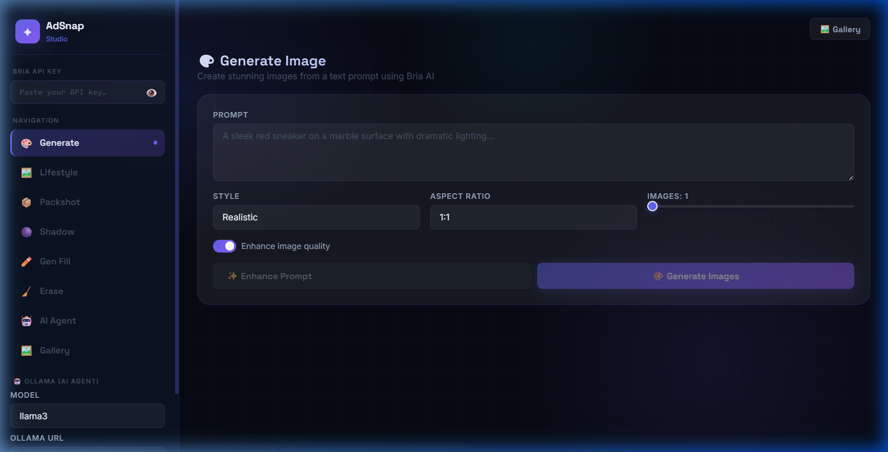
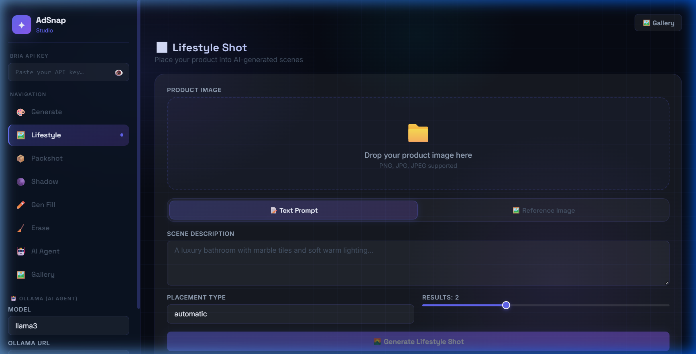
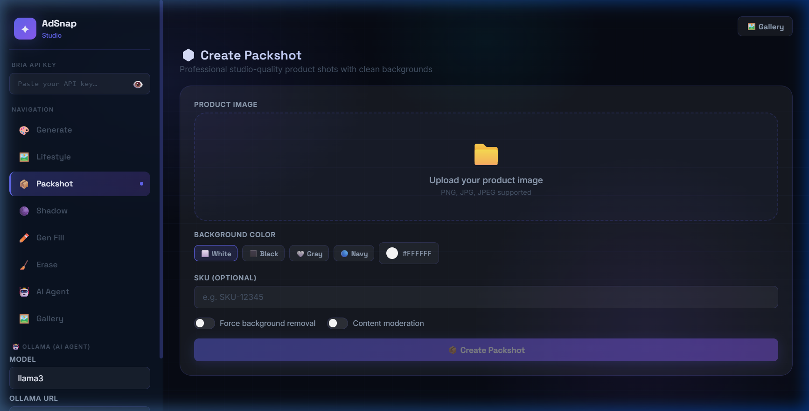
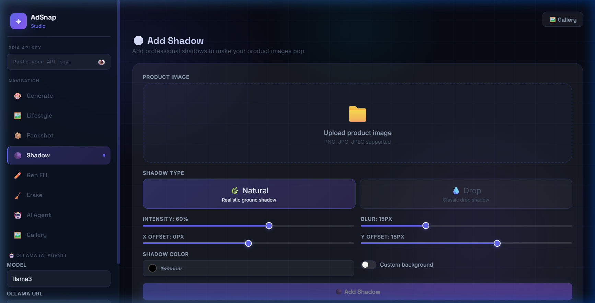
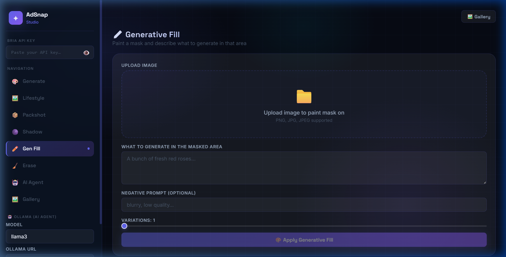
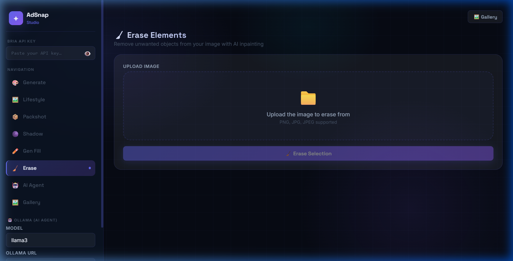
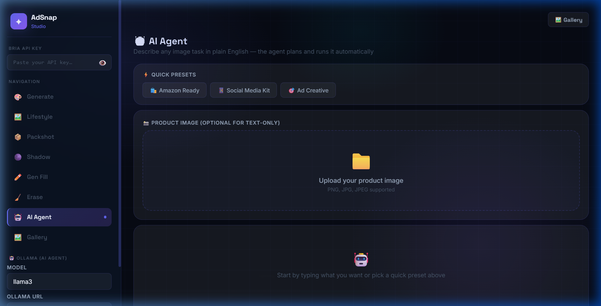
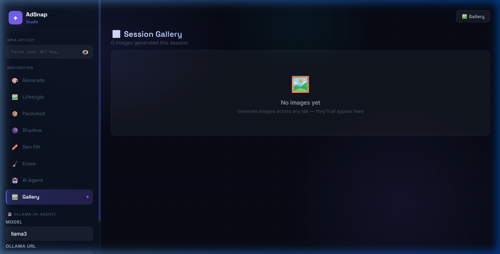

<div align="center">



<br/>

# ✦ AdSnap Studio

### AI-Powered Products Photography & Image Generation

[](https://python.org)
[](https://fastapi.tiangolo.com)
[](https://react.dev)
[](https://vitejs.dev)
[](https://bria.ai)
[](LICENSE)

**AdSnap Studio** is a full-stack AI product photography platform built on top of the [Bria AI](https://bria.ai) API. Generate studio-quality product images, create lifestyle scenes, remove backgrounds, add shadows, inpaint and erase objects — all from a modern, dark-mode React interface backed by a FastAPI server.

[**Live Demo**](#-quick-start) · [**Screenshots**](#-screenshots) · [**API Reference**](#-api-reference) · [**Contributing**](#-contributing)

</div>

---

## 🖼️ Screenshots

<table>
  <tr>
    <td align="center" width="50%">
      <strong>🎨 Generate Image</strong><br/>
      
    </td>
    <td align="center" width="50%">
      <strong>🖼️ Lifestyle Shot</strong><br/>
      
    </td>
  </tr>
  <tr>
    <td align="center" width="50%">
      <strong>📦 Packshot</strong><br/>
      
    </td>
    <td align="center" width="50%">
      <strong>🌑 Add Shadow</strong><br/>
      
    </td>
  </tr>
  <tr>
    <td align="center" width="50%">
      <strong>✏️ Generative Fill</strong><br/>
      
    </td>
    <td align="center" width="50%">
      <strong>🧹 Erase Elements</strong><br/>
      
    </td>
  </tr>
  <tr>
    <td align="center" width="50%">
      <strong>🤖 AI Agent</strong><br/>
      
    </td>
    <td align="center" width="50%">
      <strong>🖼️ Session Gallery</strong><br/>
      
    </td>
  </tr>
</table>

---

## ✨ Features

| Feature | Description |
|---|---|
| 🎨 **Generate Image** | Text-to-image with style, aspect ratio, and AI prompt enhancement |
| 🖼️ **Lifestyle Shot** | Place your product into AI-generated or reference-image scenes |
| 📦 **Packshot** | Professional studio shots with custom background colors |
| 🌑 **Add Shadow** | Natural or drop shadows with intensity, blur, and offset controls |
| ✏️ **Generative Fill** | Paint a mask and describe what to generate in that area |
| 🧹 **Erase Elements** | Remove any object from an image with a single brush stroke |
| 🤖 **AI Agent** | Plain-English multi-step workflows — describe it, the agent runs it |
| 🖼️ **Session Gallery** | All results auto-saved, filterable, and downloadable |
| 🧠 **Agent Memory** | The agent remembers your preferences across requests |

---

## 🏗️ Architecture

```
AdSnap Studio
├── services/                 ← Bria AI API wrappers (Python) — UNCHANGED
│   ├── hd_image_generation.py
│   ├── lifestyle_shot.py
│   ├── packshot.py
│   ├── shadow.py
│   ├── generative_fill.py
│   ├── erase_foreground.py
│   ├── prompt_enhancement.py
│   ├── agent.py              ← Intent parsing + plan execution
│   └── memory.py
│
├── backend/                  ← FastAPI REST server (port 8000)
│   ├── main.py               ← App entrypoint + CORS
│   ├── utils.py              ← Shared URL extractor
│   ├── memory_store.py       ← In-process agent memory
│   └── routers/
│       ├── generate.py       ← POST /api/generate
│       ├── lifestyle.py      ← POST /api/lifestyle/text|image
│       ├── packshot.py       ← POST /api/packshot
│       ├── shadow.py         ← POST /api/shadow
│       ├── fill.py           ← POST /api/fill
│       ├── erase.py          ← POST /api/erase
│       └── agent.py          ← POST /api/agent/parse|execute|answer
│
└── frontend/                 ← React + Vite SPA (port 5173)
    └── src/
        ├── App.jsx           ← Root + tab router + gallery state
        ├── index.css         ← Full design system (dark glassmorphism)
        ├── api/index.js      ← All fetch wrappers
        ├── components/
        │   ├── Sidebar.jsx   ← API key, nav, Ollama, memory panel
        │   ├── MaskCanvas.jsx← HTML Canvas mask painter
        │   ├── UploadZone.jsx← Drag-and-drop file upload
        │   ├── ResultGrid.jsx← Image grid with lightbox + download
        │   └── Spinner.jsx
        └── pages/
            ├── GeneratePage.jsx
            ├── LifestylePage.jsx
            ├── PackshotPage.jsx
            ├── ShadowPage.jsx
            ├── FillPage.jsx
            ├── ErasePage.jsx
            ├── AgentPage.jsx
            └── GalleryPage.jsx
```

---

## 🚀 Quick Start

### Prerequisites

| Requirement | Version | Notes |
|---|---|---|
| Python | 3.9+ | For the FastAPI backend |
| Node.js | 18+ | For the React frontend |
| Bria AI API Key | — | [Get one free at bria.ai](https://bria.ai) |
| Ollama *(optional)* | any | For AI Agent natural language parsing |

### 1. Clone the repository

```bash
git clone https://github.com/Utkarshkarki/GENAI_IMAGE_GENERATION.git
cd GENAI_IMAGE_GENERATION
```

### 2. Install backend dependencies

```bash
pip install fastapi "uvicorn[standard]" python-multipart python-dotenv requests Pillow
```

### 3. Install frontend dependencies

```bash
cd frontend
npm install
cd ..
```

### 4. Configure your API key

Create a `.env` file in the project root *(optional — you can also paste the key in the sidebar at runtime)*:

```env
BRIA_API_KEY=your_bria_api_key_here
```

### 5. Run the backend

```bash
# From project root
python -m uvicorn backend.main:app --reload --port 8000
```

The API will be available at **http://localhost:8000**. Interactive docs at **http://localhost:8000/docs**.

### 6. Run the frontend

```bash
# In a second terminal
cd frontend
npm run dev
```

Open **http://localhost:5173** — that's it! 🎉

---

## 🤖 AI Agent Setup (Optional)

The AI Agent uses [Ollama](https://ollama.com) to understand natural language and build execution plans.

```bash
# Install Ollama from https://ollama.com, then:
ollama pull llama3      # Best quality (~4.7 GB)
ollama pull phi3        # Balanced  (~2.3 GB)
ollama pull tinyllama   # Fastest   (~637 MB)
```

> **Without Ollama:** The agent still works using keyword-based planning — no LLM required.

---

## 📖 Usage Guide

### 🎨 Generate Image

1. Enter a text prompt describing your image
2. Choose **Style** (Realistic, Artistic, Cartoon, Watercolor…)
3. Set **Aspect Ratio** and number of images
4. Click **✨ Enhance Prompt** to let AI improve your description
5. Click **🎨 Generate Images**

### 🖼️ Lifestyle Shot

1. Upload your product image
2. Choose **Text Prompt** or **Reference Image** mode
3. Describe the scene, or upload a reference background photo
4. Select a **Placement Type** (Automatic, Original, Manual…)
5. Click **Generate Lifestyle Shot**

### 📦 Packshot

1. Upload your product image
2. Choose a background color (white, black, or custom)
3. Toggle **Force Background Removal** if needed
4. Click **Create Packshot**

### 🌑 Add Shadow

1. Upload your product image
2. Choose **Natural** or **Drop** shadow
3. Adjust intensity, blur, and offset with sliders
4. Click **Add Shadow**

### ✏️ Generative Fill

1. Upload your image
2. **Paint the area** you want to replace using the brush
3. Click **✓ Use Mask** to confirm the selection
4. Describe what to generate in that area
5. Click **Apply Generative Fill**

### 🧹 Erase Elements

1. Upload your image
2. **Paint over** the object(s) you want to remove
3. Click **Erase Selection**

### 🤖 AI Agent

Use **Quick Presets** or type any request in plain English:

| Preset | What it runs |
|---|---|
| 🛍️ **Amazon Ready** | Packshot (white bg) → Natural shadow |
| 📱 **Social Media Kit** | 4 lifestyle shots in different placements |
| 🎯 **Ad Creative** | Lifestyle shot with a coffee-shop scene |

Or write your own:
```
Put this product on a white background then add a soft drop shadow
Generate 4 lifestyle shots of this perfume in a luxury bathroom
Create an Amazon-ready packshot with a natural shadow
```

The agent shows a **Plan Preview** before running — review it, then click **✅ Confirm & Run**.

---

## 📡 API Reference

The backend exposes a REST API at `http://localhost:8000`. Full interactive docs available at `/docs`.

All endpoints require the header: `x-api-key: <your-bria-api-key>`

| Method | Endpoint | Description |
|---|---|---|
| `POST` | `/api/generate` | Text-to-image generation |
| `POST` | `/api/enhance-prompt` | AI prompt enhancement |
| `POST` | `/api/lifestyle/text` | Lifestyle shot from text description |
| `POST` | `/api/lifestyle/image` | Lifestyle shot from reference image |
| `POST` | `/api/packshot` | Create professional packshot |
| `POST` | `/api/shadow` | Add shadow to product image |
| `POST` | `/api/fill` | Generative fill (inpainting) |
| `POST` | `/api/erase` | Erase foreground object |
| `POST` | `/api/agent/parse` | Parse natural language into a plan |
| `POST` | `/api/agent/execute` | Execute an agent plan |
| `POST` | `/api/agent/answer` | Answer a question via Ollama |
| `GET` | `/api/agent/memory` | Get agent memory preferences |
| `DELETE` | `/api/agent/memory/{key}` | Delete a memory entry |
| `GET` | `/api/health` | Health check |

---

## 📦 Dependencies

### Backend

| Package | Purpose |
|---|---|
| `fastapi` | REST API framework |
| `uvicorn` | ASGI server |
| `python-multipart` | Multipart form / file upload handling |
| `python-dotenv` | `.env` file loading |
| `requests` | HTTP calls to Bria API and Ollama |
| `Pillow` | Image processing utilities |

### Frontend

| Package | Purpose |
|---|---|
| `react` + `vite` | UI framework and build tool |
| `react-hot-toast` | Toast notifications |
| `lucide-react` | Icon library |
| `axios` | HTTP client |

---

## 🔑 Getting a Bria API Key

1. Go to **[bria.ai](https://bria.ai)** and create a free account
2. Open **Dashboard → API Keys**
3. Copy your key
4. Paste it in the **sidebar** of the app — it saves automatically in your browser

> The key is stored in `localStorage` only — it never leaves your machine or reaches any server other than Bria's.

---

## 🏗️ Tech Stack

```
Frontend          Backend           AI / APIs
─────────         ─────────         ─────────
React 18          FastAPI           Bria AI (image generation)
Vite 5            Python 3.11       Ollama (local LLM)
HTML Canvas       Uvicorn           llama3 / mistral / phi3
react-hot-toast   Pydantic v2
Space Grotesk     python-multipart
Inter font
```

---

## 🤝 Contributing

Contributions are very welcome! Here's how to get started:

```bash
# Fork the repo, then:
git clone https://github.com/YOUR_USERNAME/GENAI_IMAGE_GENERATION.git
cd GENAI_IMAGE_GENERATION

# Create a feature branch
git checkout -b feature/your-feature-name

# Make changes, then submit a PR
```

Please open an issue first for significant changes. All PRs should:
- Follow the existing code style
- Add or update documentation as needed
- Not break existing service interfaces

---

## 📄 License

This project is licensed under the **MIT License** — see the [LICENSE](LICENSE) file for details.

---

## 🙏 Acknowledgements

- [**Bria AI**](https://bria.ai) — Responsible AI for commercial image generation and editing
- [**Ollama**](https://ollama.com) — Run large language models locally
- [**FastAPI**](https://fastapi.tiangolo.com) — Modern, fast Python web framework
- [**Vite**](https://vitejs.dev) — Next-generation frontend tooling
- [**Space Grotesk**](https://fonts.google.com/specimen/Space+Grotesk) — Beautiful geometric typeface

---

<div align="center">

Built with ❤️ using [Bria AI](https://bria.ai) · [React](https://react.dev) · [FastAPI](https://fastapi.tiangolo.com)

⭐ **Star this repo** if you find it useful!

</div>
